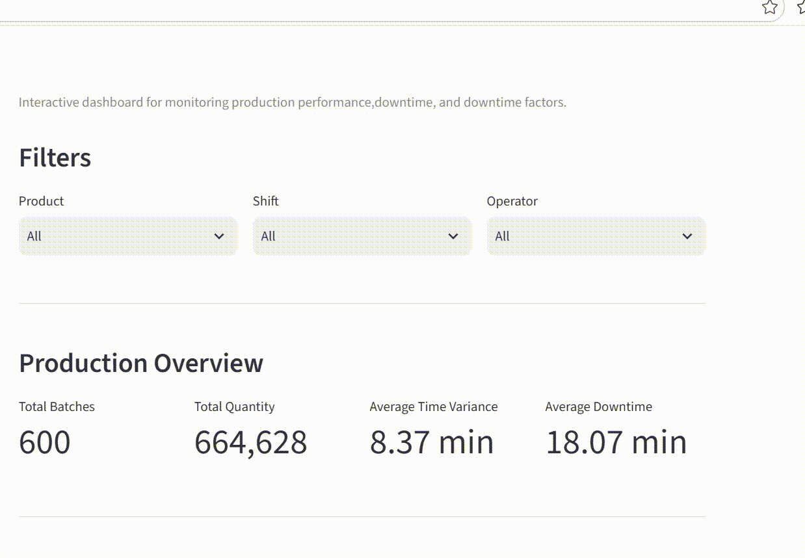

# Manufacturing Production Analytics

## Project Overview
*Manufacturing Production Analytics* adalah proyek portofolio *Data Engineering* yang dirancang untuk menunjukkan implementasi sederhana dari *end-to-end* data *pipeline* menggunakan data produksi manufaktur.
Proyek ini mengintegrasikan data produksi, produk, dan *downtime* untuk menganalisis kinerja produksi, mengidentifikasi pola *downtime*, serta menyediakan *dashboard* interaktif untuk *monitoring* metrik-metrik utama produksi.
*Dataset* dalam proyek ini dibuat secara sintesis yang khusus digunakan untuk kebutuhan pembelajaran dan demonstrasi portofolio. Data tersebut tidak merepresentasikan data dari perusahaan atau industri tertentu.

## Tujuan 
Proyek ini bertujuan untuk menunjukkan kemampuan dalam:
- Melakukan pemeriksaan kualitas data dasar.
- Mengekstrak data dari file CSV.
- Mentransformasi dan mengintegrasikan beberapa *dataset*.
- Memuat data yang telah diproses dalam *dataset* relasional.
- Melakukan analisis berbasis SQL menggunakan operasi agregasi JOIN.
- Membangun *dashboard* interaktif untuk *monitoring* produksi.
- Menghasilkan *insight* deskriptif dari data manufaktur.

## Dataset
Proyek ini menggunakan 4 *dataset* sintetis.
1. `product.csv`

Berisi informasi referensi produk.

| Kolom                     | Deskripsi                                                                  |
| ------------------------- | -------------------------------------------------------------------------- |
| `product_id`              | ID unik                                                                    |
| `product_name`            | Nama produk                                                                |
| `size`                    | ukuran produk                                                              |
| `standard_batch_time_min` | Waktu standar yang diperlukan untuk menyelesaikan satu *batch* (dalam menit) |

2. `production.csv`
   
Berisi catatan produksi setiap *batch*.

| Kolom                   | Deskripsi                                                           |
| ----------------------- | ------------------------------------------------------------------- |
| `batch_id`              | ID unik *batch* produksi                                            |
| `date`                  | Tanggal produksi                                                    |
| `product_id`            | ID produksi                                                         |
| `operator`              | Operator yang bertanggung jawab atas *batch*                        |
| `shift`                 | *Shift* produksi                                                    |
| `start_time`            | Waktu mulai *batch*                                                 |
| `end_time`              | Waktu selesai *batch*                                               |
| `actual_batch_time_min` | Waktu aktual yang dibutuhkan untuk menyelesaikan batch (dalam menit)|
| `quantity_produced`     | Jumlah produk yang dihasilkan                                       |

3. `downtime.csv`
   
Berisi catatan kejadian *downtime* terkait *batch* produksi.

| Kolom              | Deskripsi                        |
| ------------------ | -------------------------------- |
| `downtime_id`      | ID unik kejadian *downtime*      |
| `batch_id`         | ID *batch* produksi yang terkait |
| `factor_id`        | ID faktor *downtime*             |
| `downtime_minutes` | Durasi *downtime* (dalam menit)  |

4. `downtime_factors.csv`
   
Berisi informasi penyebab terjadinya *downtime*.

| Kolom            | Deskripsi                             |
| ---------------- | ------------------------------------- |
| `factor_id`      | ID unik faktor *downtime*             |
| `factor_name`    | Penyebab *downtime*                   |
| `category`       | Kategori *downtime*                   |
| `operator_error` | Menunjukkan apakah kesalahan operator |

## Pemeriksaan Kualitas Data
Sebelum transformasi data, *dataset* diperiksa untuk mengidentifikasi kualitas data dasar, meliputi:
- Dimensi *dataset* ~ `.shape`
- Informasi data, seperti tipe data ~ `.info()`
- Nilai yang hilang (*missing value*) ~ `.isnull().sum()`
- Data duplikat ~ `.duplicated().sum()`
- Statistik dasar ~ `.describe()`
Hasilnya menunjukkan tidak ada data yang hilang atau duplikasi data. *Dataset* sumber disimpan tanpa perubahan di folder `data`.

## Transformasi Data
Beberapa transformasi dilakukan selama proses ETL, antara lain:
1. Integrasi Data Produk
   
Data `production` digabungkan dengan data `product` menggunakan `product_id`. Proses ini menambahkan informasi produk dan waktu standar produksi per *batch* ke dalam data produksi.
2. Variansi Waktu

Kinerja produksi dievaluasi berdasarkan selisih antara waktu aktual dan waktu standar penyelesaian *batch* menggunakan `time_variance_min = actual_batch_time_min - standard_batch_time_min`. Nilai positif menunjukkan bahwa *batch* membutuhkan waktu lebih lama dibandingkan waktu standar penyelesaiannya.
3. Agregasi Downtime

Data kejadian *downtime* diagregasikan berdasarkan *batch_id* untuk menghitung total *downtime* yang dialami setiap *batch* produksi.*Batch* yang tidak memiliki catatan *downtime* diberi nilai `downtime_minutes = 0`. *Field `downtime_status`* juga dibuat menjadi 2 kategori:
    - **Has Downtime** untuk *batch* yang memiliki catatan *downtime*.
    - **No Downtime** untuk *batch* yang tidak memiliki catatan *downtime*.

## Desain Database
*Dataset* yang telah ditransformasikan dan *dataset* sumber dimuat ke dalam *database* SQLite.
*Dataset* terdiri dari tiga tabel utama:

manufacturing.db
├── production_analysis
├── downtime
└── downtime_factors

Adapun relasi antar tabel sebelum ditranformasi sebagai berikut:
products
    │
    │ product_id
    ▼
production
    │
    │ batch_id
    ▼
downtime
    │
    │ factor_id
    ▼
downtime_factors

Struktur relasional ini memungkinkan berbagai *dataset* untuk digabungkan (JOIN) ketika dibutuhkan informasi tambahan untuk analisis.

## SQL Analysis
SQL digunakan untuk menganalisis kinerja produksi dan pola *downtime*, meliputi:
1. Kinerja Produksi Berdasarkan Produk
- Total *batch* produksi
- Rata-rata variansi waktu
- Rata-rata *downtime*
- Rata-rata jumlah produk yang dihasilkan
2. Kinerja Produksi Berdasarkan *Shift*
- Pagi
- Siang
- Malam
3. Kinerja Produksi Berdasarkan Operator
Membandingkan metrik produksi deskriptif untuk setiap operator
4. Downtime vs Kinerja Produksi
Membandingkan kinerja produksi antara batch yang mengalami *downtime* dan *batch* yang tidak mengalami *downtime*.
Analisis ini bersifat deskriptif dan tidak menyatakan bahwa *downtime* secara langsung menyebabkan keterlambatan produksi.
5. Batch dengan Downtime Tertinggi
Mengidentifikasi *batch* produksi dengan akumulasi downtime tertinggi.
6. Downtime Berdasarkan Faktor
Data kejadian downtime digabungkan (JOIN) dengan tabel referensi faktor *downtime* untuk mengidentifikasi penyebab utama *downtime*.

Contoh SQL:
SELECT
    df.factor_name,
    SUM(d.downtime_minutes) AS total_downtime
FROM downtime d
JOIN downtime_factors df
    ON d.factor_id = df.factor_id
GROUP BY df.factor_name
ORDER BY total_downtime DESC;

## Dashboard
*Dashboard* interaktif dikembangkan menggunakan Streamlit, yang menyediakan beberapa fitur utama, yaitu:
1. Filter Interaktif

  

2. Ringkasan Produksi

  

3. Kinerja Produksi

  

  

  

4. Analisis *Downtime*

  

5. Tabel Data Produksi

  

## Key Insights
Berdasarkan *dataset* sintesis terdapat beberapa temuan, antara lain:
- *Dataset* terdiri dari 600 *batch* produksi.
- Sebanyak 435 *batch* memiliki *downtime* yang tercatat, sedangkan 165 *batch* tidak memiliki *downtime* yang tercatat
- Rata-rata variasi waktu pada *batch* yang mengalami *downtime* lebih tinggi dibandingkan dengan *batch* yang tidak mengalami *downtime*.
- *Machine Failure* (Kegagalan Mesin) memiliki total akumulasi *downtime* tertinggi.
- *Changeover* (Pergantian/penyesuaian proses) dan *Preventive* Maintenance (Pemeliharaan Preventif) menjadi kontributor terbesar berikutnya terhadap akumulasi *downtime*.

## Project Structure

Manufacturing-Production-Analytics/
│
├── dashboard/
│   └── app.py
│
├── data/
│   ├── downtime.csv
│   ├── downtime_factors.csv
│   ├── production.csv
│   └── products.csv
│
├── etl/
│   ├── extract.py
│   ├── load.py
│   └── transform.py
│
├── images/
│
├── notebooks/
│   └── Manufacturing_Production_Analytics.ipynb
│
├── sql/
│   └── analysis.sql
│
├── manufacturing.db
├── README.md
└── requirements.txt

## Teknologi
- Python
- Pandas — ekstraksi dan transformasi data
- SQLAlchemy — pemuatan data ke database
- SQLite — *database* relasional
- SQL — analisis data dan operasi JOIN
- Streamlit — *dashboard* interaktif
- Google Colab — data eksploratif
- VS Code — development environment

## How to Run
1. Clone the repository
   
`git clone <repository-url>`

`cd manufacturing-production-analytics`

2. Create and activate a virtual environment
   
`python -m venv .venv`

`.venv\Scripts\activate`

3. Install dependencies
   
`pip install -r requirements.txt`

4. Run the ETL pipeline

`python etl/load.py`

Ini memuat data produksi yang telah ditransformasi beserta tabel pendukung *downtime* ke dalam: `manufacturing.db`

5. Run the dashboard

`streamlit run dashboard/app.py`

Dashboard Streamlit dapat diakses secara lokal.
